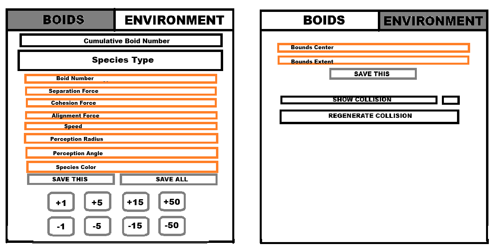

# Boids Simulation in Unreal Engine

This project is my deep dive into the classic Boids flocking algorithm, which I've been fascinated by a couple of years and now is the time to finally explore them. I will learn programming concepts like spatial partitioning and GPU-based compute shaders while improving my skills in the Unreal Engine.

My goal isn't just to get something that looks cool but also to develop an efficient system that can be adjusted and expanded upon.

---

### Table of Contents

1. [So, What are Boids? 🤔](#so-what-are-boids-)
   - [Early Development & Boundary Handling](#early-development--boundary-handling)
2. [Project Architecture and Class Structure](#project-architecture-and-class-structure)
   - [Core Simulation Layer](#core-simulation-layer)
   - [Visual Layer](#visual-layer)
   - [Data and Tooling](#data-and-tooling)
3. [Spatial Partitioning: Voxel Grid vs. Octree](#spatial-partitioning-voxel-grid-vs-octree)
4. [Future Development Roadmap](#future-development-roadmap)

---

## So, What are Boids? 🤔

Boids are basically simulated "bird-like objects." The cool part is that their complex, lifelike flocking behavior comes from just three simple rules that each boid follows on its own:

1. **Separation** – Steer to avoid crowding local flockmates.  

2. **Alignment** – Steer towards the average heading of local flockmates.  

3. **Cohesion** – Steer to move toward the average position of local flockmates.  

When you combine these rules, the pattern emerges which can be seen in real flocks of birds or schools of fish!

### Early Development & Boundary Handling

In the initial stages of development, the simulation had no collision boundaries. To keep the boids contained, I implemented a "wrapping" behavior where a boid exiting one side of the bounds would instantly teleport to the opposite side.

Here's a look at boids with wrapping mechanic:

This was later replaced by a "soft wall" collision system, which uses pre-computed force vectors to steer boids away from the boundaries, resulting in a more natural look.

And here's with boundry collisions:

---

## Project Architecture and Class Structure

The simulation works on **2 different layers** that separates the main logic from its visual representation. For now there is no data loading, just hardcoded values.

### Core Simulation Layer 

Lightweight C++ classes and structs that manage data without relying on Unreal's Actor framework.  
* `FBoid`: Simple data struct representing one boid with `Position`, `Velocity` and `Acceleration`. It has no logic besides a basic `Update` to adjust its position.
* `FBounds` / `FWorldCollisionBounds`: Custom AABB implementation and its child class, which manages a voxelized grid. This grid is pre-computed with "soft wall" force vectors that steer boids away from its boundaries. It will later be replaced with a more generic version.
* `UBoidManagerSubsystem`: Core of the simulation. This `UTickableWorldSubsystem` owns and updates all boids each frame. Its responsibilities include:  
    * Calculating all boid forces (separation, alignment, cohesion, collision).  
    * Broadcasting delegates when simulation data changes.  

### Visual Layer 

Couple of `AActor` classes that represent the simulation in the game world. They mostly listen and respond to the `BoidManagerSubsystem`.  
* `AVisualBoid`: Visual representation of a single boid, containing just a mesh. Its position and rotation are updated by the `AVisualBoidManager`.  
* `AVisualBoidManager`: Actor that listens to the `BoidManagerSubsystem`. It manages a pool of `AVisualBoid` actors, updating their position and rotation to align with their simulation's counterparts.  
* `AVisualWorldBounds`: Actor that shows the simulation boundaries, adjusting its scale and position according to the updates from the subsystem.  

### Data and Tooling

This will enable in-editor tweaking of simulation's parameters.  
* `UBoidsData`: A `UDataAsset`-based class that contains all the relevant data for boids (like force multipliers, desired speed, perception radius, color).  
* **Editor Utility Widget:** In-progress tool that will allow for real-time manipulation of data assets and simulation parameters, giving instant visual changes in the editor. It is in very early development and it will take me some time, since it is also a deep dive into Unreal Engine's tooling. I've already implemented basic transactable float fields and vector fields, which I would like to expand upon and implement transactable checkboxes and dropdowns if time allows.

**Here are some of the planned features:**  
* **Boid Panel:**  
    * Adjust Separation, Cohesion, and Alignment forces per species.  
    * Change speed, perception radius, and vision cone.  
    * Modify species color.  
    * Add or remove boids from the simulation during runtime.  
* **Environment Panel:**  
    * Change the simulation bounds (center and extent).  
    * Trigger a recalculation of the environment collision grid.  
    * Display the collision grid and its force vectors for debugging.  

Here is an early design of how it will look later on (*don't take the color scheme seriously, it's a prototype*).

---

## Spatial Partitioning: Voxel Grid vs. Octree

To improve the neighbor search from a brute force `O(N²)` check, I looked into both Octrees and Voxel Grids (Uniform Grids). While Octrees work well in sparse environments, I ultimately chose a **Voxel Grid**, despite my initial learning of QuadTrees, which really pushed me into making this project. Here are my thoughts and specific reasons on why I picked the second one:

* **Distribution:** The boids should be fairly uniformly spread throughout the simulation area. Voxel Grids are excellent in dense or uniform scenarios.  
* **Lookup Speed:** Voxel Grids provide a constant-time `O(1)` lookup for knowing in which cell a boid is. An Octree's lookup is `O(log n)`, which is still quick but slower.  
* **Dynamic Objects:** Since boids move every frame, an Octree would need to be partially or fully rebuilt frequently, which was the main argument for me. A Voxel Grid, being a simple array, is significantly easier to update with the boids' new positions each frame.

I still do believe OctTrees are definitely a better alternative for very large and sparse areas, such as an open worlds.

---

## Future Development Roadmap

Since it is my main project, I structured it with clear roadmap goals to make it easier for me to track the progress:

1. **Implement Tool UI:** Create the visual interface for the Editor Utility Widget.
2. **Template Voxel Grid:** Develop a generic, reusable Voxel Grid class to optimize boid-to-boid collision and neighbor finding. I will also use this class in a future project on 3D pathfinding. Test performance between brute force solution - `O(N²)` and newly created VoxelGrid - `O(N * K)`.
3. **Environment Collision Grid:** Set up the voxelized collision system for static geometry using the generic class.  
4. **Data Integration:** Connect the Editor Tool and `UBoidManagerSubsystem` to load and save `UBoidsData` assets
5. **Template Object Pool:** Create a generic object pool for managing `FBoid`, `AVisualBoid` actors, and Threads.  
6. **Compute Shader (Boid Logic):** Major optimization target and personal minimal goal, shift the main boid update loop to a compute shader to take advantage of insanely powerful GPUs.  
7. **Compute Shader (Voxel Grid):** If time permits, move the Voxel Grid neighbor search to a compute shader as well for even bigger performance increase.
8. **Compute Shader (Collision Generation):** As a final goal, transfer the pre-computation of the environment collision data into it as well.

Thank you for taking the time and reading through all of this! So far I have been enjoying this journey and look forward to pushing it even further.