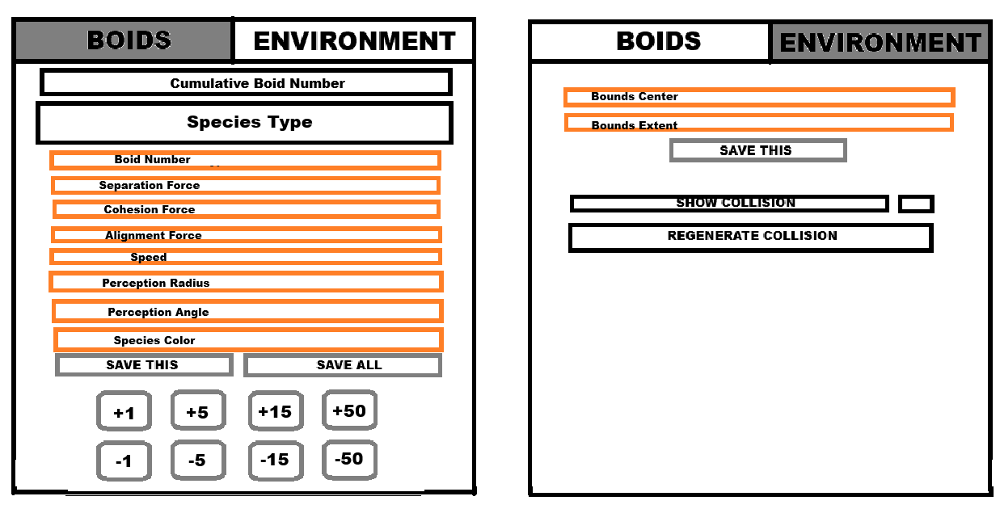
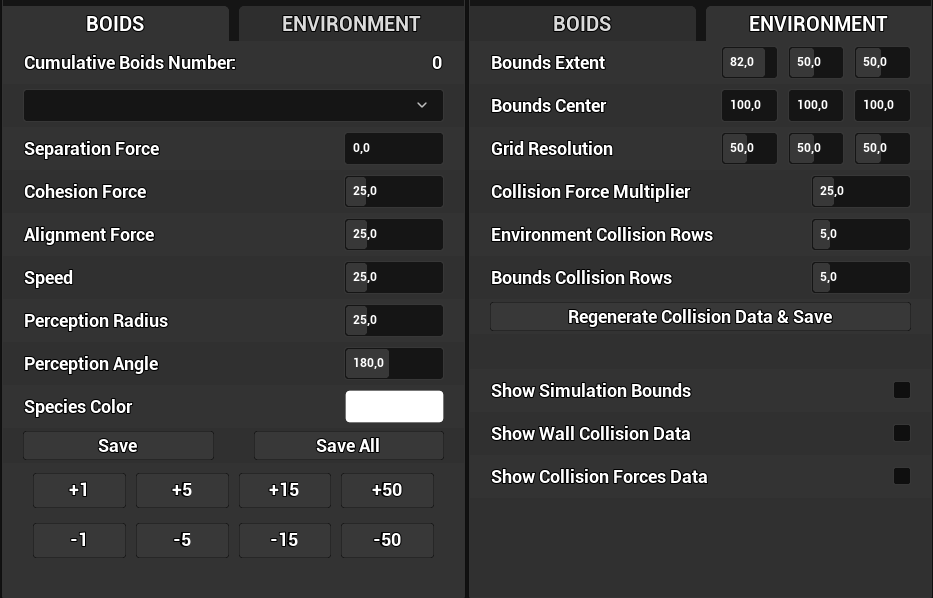
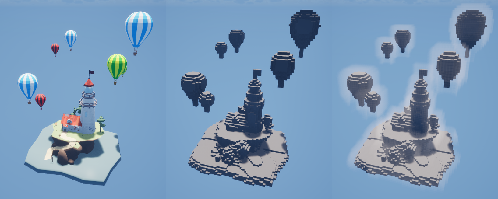

# Boids Simulation in Unreal Engine

This project is my deep dive into the classic Boids flocking algorithm, something I’ve been fascinated by for years and finally had the chance to explore properly. The focus was on building a real-time flocking simulation in Unreal Engine, with an emphasis on clean system architecture, spatial partitioning, and understanding where performance actually matters.

My goal wasn't just to get something that looks cool, but to build a flexible, efficient simulation that I could experiment with and really understand how it worked.

---

### Table of Contents

1. [So, What are Boids? 🤔](#so-what-are-boids-)
2. [Project Architecture and Class Structure](#project-architecture-and-class-structure)
   - [Core Simulation Layer](#core-simulation-layer)
   - [Visual Layer](#visual-layer)
   - [Data Management & Asset Pipeline](#data-management--asset-pipeline)
   - [Evolution of the Editor Tool](#evolution-of-the-editor-tool)
3. [Spatial Partitioning: Voxel Grid vs. Octree](#spatial-partitioning-voxel-grid-vs-octree)
4. [Environment Voxelization & Static Geometry Collision Handling](#environment-voxelization--static-geometry-collision-handling)
5. [Optimization & Performance Comparison](#optimization--performance-comparison)
   - [Visual Update Optimization](#visual-update-optimization)
   - [Rebuilding vs. Incremental Grid Updates](#rebuilding-vs-incremental-grid-updates)
   - [Order-Dependent Benchmark Behavior](#order-dependent-benchmark-behavior)
   - [Neighbor Search: Brute Force vs. Voxel Grid](#neighbor-search-brute-force-vs-voxel-grid)
      - [Test Configuration](#test-configuration)
      - [Perception Radius vs. Grid Resolution](#perception-radius-vs-grid-resolution)
      - [Measurement Approach](#measurement-approach)
      - [Brute Force Neighbor Search](#brute-force-neighbor-search)
      - [Voxel Grid Neighbor Search](#voxel-grid-neighbor-search)
      - [Key Takeaways](#key-takeaways)
6. [From Simulation to a Game-Ready System](#from-simulation-to-a-game-ready-system)
   - [CPU Multithreading and Shaders](#cpu-multithreading-and-shaders)
   - [Group-Oriented Simulation](#group-oriented-simulation)
   - [Dynamic Spatial Partitioning](#dynamic-spatial-partitioning)
   - [Dynamic World Interaction](#dynamic-world-interaction)
   - [Math and Behavioral Approximation](#math-and-behavioral-approximation)
   - [Tooling Adjustments](#tooling-adjustments)
7. [Final Thoughts](#final-thoughts)

---

## So, What are Boids? 🤔

Boids are basically simulated "bird-oid objects." The cool part is that their complex, lifelike flocking behavior comes from just three simple rules that each boid follows on its own:

1. **Separation** – Steer to avoid crowding local flockmates.  
2. **Alignment** – Steer towards the average heading of local flockmates.  
3. **Cohesion** – Steer to move toward the average position of local flockmates.  

When you combine these rules, the pattern emerges which can be seen in real flocks of birds or schools of fish!

---

## Project Architecture and Class Structure

The simulation works on **3 different layers** that separate the main logic from its visual representation and the data pipeline.

### Core Simulation Layer 

C++ classes and structs that manage data without relying on Unreal's Actor framework.  

#### Logical Boids & Management

* `FBoid`: Simple data struct representing one boid with `Position`, `Velocity` and `Acceleration`. It has no logic besides a basic `Update` to adjust its position.
* `FBoidPool`: Object pool managing my logical `FBoids`. Allows for dynamic addition and removal of boids.
* `FBoidSpecies`: Struct storing `FBoidPool` for tracking currently simulated boids and `FBoidsSpeciesPlainInfo` for all necessary boid species related info.

* `UBoidManagerSubsystem`: Core of the simulation. This `UGameInstanceSubsystemBase` + `FTickableGameObject` initializes and manages a collection of `FBoidSpecies`, updating them every frame. Its responsibilities include:
	* Calculating all boid forces (separation, alignment, cohesion, collision). 
	* Handling parameter updates (force multipliers, speed or collision multipliers) received from the editor tools.
	* Broadcasting delegates when simulation data changes. 

#### Spatial Partitioning

* `FVoxelGrid<T>`: A template voxel grid class for storing `T` data with basic getters. This acts as a base for my specialized grid classes.
* `FWorldCollisionVoxelGrid`: A specialized child of `FVoxelGrid`. Each cell contains pre-calculated environment and bounds collision forces, as well as a flag determining valid simulation areas. This serves as a fast lookup table for collision forces during runtime.
* `FBoidCollisionVoxelGrid`: A specialized child of `FVoxelGrid`. Each cell stores unique species and boids IDs of all boids present in that cell. This is rebuild every frame to optimize the neighbor search algorithm from `O(N²)` to `O(N * K)`.

#### Communication & Math

* `BoidDelegates.h`: Header with global delegates, allowing for communication between editor world and the runtime world.
* `FBoidNumberUpdateInfo`: Helper struct used to transfer data between tool and `UBoidManagerSubsystem`. Has tag of a boid that should be added/removed and the count of it.
* `BoundsMathLibrary`: Helper math library handling all bounds-related calculations.

### Visual Layer 

Couple of `AActor` and `UObject` classes that represent the simulation within the game world. They mostly listen and respond to the `UBoidManagerSubsystem` and `UBoidDataEditorSubsystem`.  

#### Visual Boids & Management

* `UVisualBoidSpecies`: AActor visual counterpart to the `FBoidSpecies` struct. It contains `UInstancedStaticMeshComponent`, which shows active boids and shared dynamic material for color updates.

* `UVisualBoidManagerSubsystem`: Successor of the previous visual manager actor. It manages a collection of `UVisualBoidSpecies` uobjects and updates visual boids' position and rotation to align with their simulation's counterparts.

#### Environment & Config

* `AVisualSimulationBoundsData`: Actor in the world that visualizes simulation environment data. Is able to show simulation bounds, voxelized wall environment data and collision data as well as starting point of collision generation algorithm. Listens to events from `UBoidDataEditorSubsystem` for visual updates.
* `UBoidSimulationSettings`: Helper `UDeveloperSettings` class for setting initial `AVisualBoid` actor class for my `UVisualBoidManagerSubsystem`.

### Data Management & Asset Pipeline

This section covers data management, asset loading, and the tools enabling in-editor tweaking.

#### Assets & Data Transfer

* `UBoidsData` & `UBoundsData`: `UDataAsset`-based classes containing all relevant configuration data (force multipliers, speed, perception radius, grid resolution).
* `FBoidsSpeciesPlainInfo`: Helper struct for converting loaded `UBoidsData` into a struct, so I don't work on the original. Stores all of the essential info about boid species.
* `FBoundsPlainInfo` / `FSimulationBoundsPlainInfo` / `FCollisionBoundsPlainInfo`: Helper structs for converting `UBoundsData` into manageable structs. Also used for passing data between systems for easier communication (e.g. for static geometry collision generation).

#### Runtime Data Loading

* `URuntimeDataLoaderSubsystem`: Generic runtime data loader subsystem. Asynchronously loads assets on demand and broadcasts delegate on completion.
* `UBoidDataManagerSubsystem`: Specialized runtime data loader for simulation data. Stores additional relevant simulation data like global GameplayTag to species index map.

#### Editor Data Generation

* `UBoidDataEditorSubsystem`: An `UEditorSubsystem` responsible for creating, saving, and generating the simulation data, as well as broadcasting events for any bounds changes in the editor.
* `FEditorBoidDataManager`: Creates necessary `UBoidsData` & `UBoundsData` during editor time for the runtime simulation.
* `FCollisionDataGenerator`: Generates necessary collision data, which includes voxelized environment wall data and collision forces in the simulation bounds. It creates the "soft-wall" around the environment so boids will steer away naturally.

#### Utilities & Helpers

* `UGameInstanceSubsystemBase`: Base class for my subsystem classes. Created dependency to `URuntimeDataLoaderSubsystem` so it is loaded always first.
* `FEditorAssetUtils`: Helper struct for editor related asset functions like creation and saving.
* `FEditorMaterialUtils`: Helper struct for material related functions like creating additional expression in the material graph or creating material itself.
* `FRuntimeAssetUtils`: Helper struct for asset related functions like generating asset filters by class. Used in runtime and editor modules.
* `FBoidConstants`: Struct containing necessary string constants like asset paths and prefixes for data creation.
* `DebugMacros`: Header with a couple of template macros for easier debugging and development.

---

### Evolution of the Editor Tool

The primary goal of this tool has always been the **real-time manipulation of Boid parameters** (cohesion, alignment, separation, speed) to allow for instant feedback during the simulation.
*Note: Bounds and collision data are not manipulated in real-time as they require a pre-generation step.*

In the early development stage I initially planned to make checkboxes, float and vector fields **transactable**. In the end I ultimately had to drop that feature due to time constraints in order to prioritize the custom color picker made in Slate and its integration. Below is an early design of how I envisioned the tool in the beginning (*don't take the color scheme seriously, it was a prototype*).

#### The Slate Journey

As I continued developing the tool, I realized I would need to create a color picker so that the user could pick desired color. This requirement pushed me to explore **Unreal Engine's Slate API** for the first time, which was a really nice challenge. It allowed me to take a deep dive into Slate and develop my own widgets based on Unreal's original implementations.

* `UBoidEditorUtilityWidget`: Base class for the Boids' tool. Broadcasts event on begin and PIE end.
* `UColorButtonEditorUtilityWidget`: Widget spawning `SCustomColorPicker`. It serves as the bridge between the Slate widget and Blueprint implementation.
* `SCustomColorSlider`: Custom-made color slider with a background gradient of the managed color.
* `SCustomColorPicker`: Custom-made color picker with a color spectrum and RGB channel sliders. It handles events like `OnColorChanged`, `OnColorCancelled`, and `OnColorCommitted`.

And here is final design of the tool and the color picker:

---

## Spatial Partitioning: Voxel Grid vs. Octree

To improve the neighbor search from a brute force `O(N²)` check, I looked into both Octrees and Voxel Grids (Uniform Grids). While Octrees perform well in sparse environments, I ultimately chose a **Voxel Grid**, despite my initial study of QuadTrees, which really pushed me into making this project. Here's my thought process and reasoning as to why I picked the second one:

* **Distribution:** The boids should be spread fairly uniformly spread throughout the simulation area. Voxel Grids are excellent in dense or uniform scenarios.  
* **Lookup Speed:** Voxel Grids provide a constant-time `O(1)` lookup for knowing which cell contains a boid. An Octree's lookup is `O(log n)`, which is relatively quick, but is ultimately the slower choice of the two.
* **Dynamic Objects:** Since boids move every frame, an Octree would need to be partially or fully rebuilt frequently, which was the main disadvantage for me. A Voxel Grid is significantly easier to update with the boids' new positions each frame, due to being a simple array.

I still do believe OctTrees are definitely a better alternative for very large and sparse areas, such as an open worlds.

---

## Environment Voxelization & Static Geometry Collision Handling

To enable boids to interact with static world geometry, I needed a collision detection system. Many boids implementations rely on **per-boid line traces** to detect obstacles, but I intentionally avoided this approach. To clarify, I did not benchmark raycasting against my solution directly. Tracing from thousands of agents every frame simply didn’t feel like a scalable direction.

Instead, I used **a precomputed collision representation** based on voxelization of the simulation area. During **editor time,** the environment within the simulation bounds is voxelized and stored as a data asset. Then it is loaded at startup and used as a fast lookup structure for collision forces. This approach almost entirely **removes runtime collision cost,** at the expense of additional memory usage.

**The voxelization process works as follows:**

1. The simulation space is represented as a 3D voxel grid, initially treated as fully blocked.
2. A flood fill is performed from a known point inside the simulation bounds to identify reachable space.
3. Voxels that intersect WorldStatic geometry are treated as walls, while reachable voxels are marked as valid simulation area.
4. From these wall voxels, **a “soft wall”** region is generated by expanding outward for a fixed number of cells.

**At runtime, boids sample the voxel grid at their current position and apply the stored force.** This still produces smooth, natural avoidance behavior without requiring any per-frame collision queries against the world geometry.

Below are visualizations of the static simulation geometry, its voxelized representation, and the generated soft wall collision forces. Bounds extents are 2000 × 2000 × 2000, with a grid resolution of 80 × 80 × 80:

---

## Optimization & Performance Comparison

From the start, I want to clarify that I **did not** benchmark a voxel grid against an octree implementation. Both data structures were considered during the design phase (as described earlier), but due to time limitations I focused on profiling and optimizing the chosen solution.

All performance measurements were taken in a **Development build running in-editor and captured using Unreal Insights.**

### Visual Update Optimization

After running the first benchmarks of the brute force solution, frame time analysis revealed that **visual updates were a significant cost.** At the time, each boid was represented by a separate `AActor` containing a mesh, which did not scale well as boid counts increased.

To address this, I changed the representation from **per-boid actors to per-species Instanced Static Meshes (ISM).** I was already using this approach to visualize collision data, so extending it to visual boids was a natural fit. After reviewing the documentation, the key enabling function was `BatchUpdateInstancesTransforms`, which allowed all instance transforms to be updated in a single call.

The transition from actors to ISMs was relatively straightforward and resulted in a substantial reduction in visual update cost. The table below shows median execution time (in milliseconds) of `UVisualBoidManagerSubsystem::HandleBoidsUpdate`:

| Boid Count | Actor Update | ISM Update |
| ---:       | ---:         | ---:       |
| 500        | 1.03         | 0.11       |
| 1000       | 2.02         | 0.18       |
| 1500       | 3.04         | 0.25       |
| 2000       | 4.02         | 0.32       |
| 2500       | 5.04         | 0.39       |

### Rebuilding vs. Incremental Grid Updates

My initial approach was to **update the voxel grid each frame.** To make this faster, I planned to store additional indices inside `FBoid` to track each boid’s position inside the voxel grid’s subarrays.

While this seemed reasonable at first, I ultimately moved away from it for two reasons:

1. **Design complexity** - Storing voxel grid specific data inside `FBoid` was not the correct approach. The update path also became unreasonably complex, requiring:

    * Cell change detection
    * Removal from sub-arrays
    * Potential in-array swap to avoid resizing
    * Index updates for multiple boids

2. **Performance uncertainty** - This led to a key question: Is updating actually faster than rebuilding the grid from scratch?

After benchmarking both approaches, **fully rebuilding the grid every frame consistently outperformed incremental updates** across all tested scenarios at the time.

In hindsight, my initial intuition was incorrect. Rebuilding the grid turned out to be simpler, cleaner and better suited my simulation. An incremental approach might still make sense for slower-moving or mostly static agents, but for this use case, a full rebuild was the better tradeoff.

### Order-Dependent Benchmark Behavior

While working on voxel grid neighbor search, I tested two nearly identical implementations:

* **Separate arrays:** collecting neighbors into two arrays (same species vs. other species)
* **Pre-filled arrays:** passing an array of arrays (one per species) and inserting neighbors directly into their species slot

I didn’t expect much difference, but during testing I noticed something odd: **whichever implementation ran second was always slightly faster.** Reversing the execution order flipped the result. To make sure this wasn’t any real algorithmic advantage, I reran the tests using two completely separate grids and the difference disappeared entirely - both implementations performed nearly identical.

If I had to guess, this behavior is likely related to order of execution effects such as data already being loaded in CPU caches. I treat it as an observation rather than a conclusion, since I did not investigate further. This was also the first time I had encountered this kind of behavior in a real project. 

Since neither approach showed a consistent advantage once isolated, I chose the second implementation since it scales with the number of species rather than the number of neighbors.

---

### Neighbor Search: Brute Force vs. Voxel Grid

After confirming that the different voxel grid neighbor search variants performed nearly identically, I moved on to the comparison that actually mattered: **brute force neighbor search versus a voxel grid approach.**

For all test cases, I ran **4 x 20-minute** simulations. My original plan was to run **5 x 10-minute** tests, but early results showed that a 10-minute window was not nearly enough. Boids naturally start clumping over time, and as that happens, both neighbor counts and execution time steadily increase. Extending the runtime better represents a typical simulation.

The tested boid counts were: **500, 1000, 1500, 2000, and 2500.**

#### Test Configuration

All tests were performed using a single-species simulation, with the same parameters across all runs to make the comparison as fair as possible.

**Test Boid Species Parameters:**

| Parameter 			       | Value |
| :---                                 | :---  |
| **Separation Force** 		       | 4000  |
| **Alignment Force** 		       | 300   |
| **Cohesion Force** 		       | 1000  |
| **Other Species Force** 	       | 1000  |
| **Speed** 			       | 300   |
| **Perception Radius**		       | 100   |
| **Environment Collision Multiplier** | 300   |
| **Bounds Collision Multiplier**      | 400   |

**Simulation Bounds Parameters:**

| Parameter                          | Value              |
| :---                               | :---               |
| **Bounds Extent** 	    	     | 2000 x 2000 x 2000 |
| **Collision Grid Resolution**      | 80 x 80 x 80 	  |
| **Boid Collision Grid Resolution** | 20 x 20 x 20 	  |
| **Environment Collision Rows**     | 3                  |
| **Bounds Collision Rows** 	     | 5                  |

At higher counts (for example 3k or 4k), the simulation became visually unreadable due to extreme clustering, so further scaling did not provide much practical insight.

#### Perception Radius vs. Grid Resolution

One important thing that became very clear during testing is that voxel grid resolution and perception radius **need to be designed together.**

With a perception radius of 100 and bounds of 2000 x 2000 x 2000, a 20 x 20 x 20 boid collision grid results in voxel cells that are exactly 100 x 100 x 100. Each boid evaluates neighbors in its own cell and the adjacent cells. This keeps the neighbor search **as small as possible while still preserving correct behavior**. Neighboring boids are still being filtered with a perception distance check to keep the original behavior.

Even in the worst-case scenario, where a boid is positioned in a corner of its voxel, it can still “see” at least 100 units in every direction.

Increasing the boid collision grid resolution, increasing perception radius, or choosing values that do not align properly leads to a significant increase in neighbor checks. In those cases, the voxel grid still works, but the performance benefits shrink rapidly.

#### Measurement Approach

All values below represent median execution times grouped into 5-minute intervals over the 20-minute runs.

I initially attempted to reduce randomness by using a fixed seed and fixed delta time. But even then simulations with identical starting conditions still evolved differently after a short period of time. This only assured me to run multiple tests and track the median of medians for each time window.

I measured only the logical simulation cost, specifically the execution time of `UBoidManagerSubsystem::UpdateBoids`. I did not measure overall frame time, as Unreal Engine’s baseline overhead (≈6 ms in-editor) heavily affects results at lower boid counts and hides meaningful differences in the simulation code itself. The brute force solution uses only execution measurement time, since it is the most important data in that scenario.

For the voxel grid solution, I additionally recorded the median, average, and maximum number of neighbors processed per boid in each interval. These values help explain how flock density and clustering directly affect execution time. This data was collected directly in C++ during the simulation and logged at the end of each run, split into 5-minute intervals.

---

#### Brute Force Neighbor Search

The table below shows the median of simulation frame execution time (in milliseconds) of the brute force neighbor search solution.

| Boid Count / Time Window  | 0 - 5 | 5 - 10 | 10 - 15 | 15 - 20 |
| :---                      | :---  | :---   | :---    | :---    |
| **500**                   | 1.59  | 1.99   | 2.21    | 2.38    |
| **1000**                  | 6.29  | 8.47   | 10.59   | 10.38   |
| **1500**                  | 14.89 | 19.33  | 20.97   | 23.05   |
| **2000**                  | 26.96 | 33.12  | 41.16   | 43.70   |
| **2500**                  | 40.12 | 51.86  | 66.51   | 67.88   |

As expected, execution time increases with boid count. Since every boid evaluates every other boid each frame, **the full O(N²) cost is paid from the very beginning of the simulation,** even before any clustering occurs.

---

#### Voxel Grid Neighbor Search

Unlike the brute force approach, voxel grid performance is tightly coupled to the number of neighbors each boid actually processes. To better understand how clustering affects performance over time, execution time is shown together with neighbor statistics for each simulation interval.

**500 Boids:**

|                         | 0 - 5 | 5 - 10 | 10 - 15 | 15 - 20 |
| :---                    | :---  | :---   | :---    | :---    |
| **Execution Time (ms)** | 0.41  | 0.68   | 0.76    | 0.75    |
| **Median**              | 14    | 42     | 64      | 68      |
| **Average**             | 12.13 | 36.15  | 45.64   | 45.94   |
| **Max**                 | 93    | 172    | 187     | 188.5   |

**1000 Boids:**

|                         | 0 - 5 | 5 - 10 | 10 - 15 | 15 - 20 |
| :---                    | :---  | :---   | :---    | :---    |
| **Execution Time (ms)** | 1.28  | 2.12   | 2.67    | 3.54    |
| **Median**              | 28    | 71     | 95      | 131     |
| **Average**             | 29.95 | 66.79  | 95.25   | 137.02  |
| **Max**                 | 207   | 285    | 399.5   | 454     |

**1500 Boids:**

|                         | 0 - 5 | 5 - 10 | 10 - 15 | 15 - 20 |
| :---                    | :---  | :---   | :---   | :---     |
| **Execution Time (ms)** | 2.69  | 5.48   | 8.24   | 8.68     |
| **Median**              | 40    | 122    | 266    | 208      |
| **Average**             | 49.37 | 133.54 | 215.66 | 221.84   |
| **Max**                 | 346   | 491    | 664    | 787      |

**2000 Boids:**

|                         | 0 - 5 | 5 - 10 | 10 - 15 | 15 - 20 |
| :---                    | :---  | :---   | :---    | :---    |
| **Execution Time (ms)** | 4.30  | 13.08  | 21.30   | 14.89   |
| **Median**              | 48    | 232    | 435     | 351     |
| **Average**             | 65.90 | 262.62 | 433.91  | 306.67  |
| **Max**                 | 514   | 813    | 1198    | 911     |

The drop in the final window is likely due to cluster breakup.

**2500 Boids:**

|                         | 0 - 5 | 5 - 10 | 10 - 15 | 15 - 20 |
| :---                    | :---  | :---   | :---    | :---    |
| **Execution Time (ms)** | 6.43  | 17.28  | 20.28   | 20.91   |
| **Median**              | 62    | 241    | 336     | 328     |
| **Average**             | 82.49 | 263.18 | 301.47  | 329.64  |
| **Max**                 | 669   | 1111   | 1026    | 1106    |

Across all tested boid counts, the voxel grid **significantly reduces execution time compared to the brute force approach,** especially during the early stages of the simulation when flock density is low.

As the simulation progresses and boids begin to form denser clusters, neighbor counts increase, which is reflected in higher execution times. While extreme clustering reduces the efficiency of the voxel grid, it still maintains a clear performance advantage over the brute force solution in all tested scenarios.

---

#### Key Takeaways

* Brute force neighbor search evaluates every boid against every other boid each frame, resulting in O(N²) cost from the start of the simulation.
* Voxel grid approach shifts the cost from total boid count to the number of nearby neighbors, resulting in significantly lower execution times.
* The effectiveness of a voxel grid depends strongly on parameter alignment, particularly grid resolution and boids' perception distance.
* Measuring performance over extended simulation time reveals behavior that short benchmarks can miss.

---

## From Simulation to a Game Ready System

This project works well as a simulation, but it is not intended to be production ready for a real game. During development, I spent time thinking about what would need to change for it to function in a real gameplay environment. Below are some of my thoughts on what this system would look like.

### CPU Multithreading and Shaders

For larger boid counts, the simulation would need to move beyond a single thread. Multithreaded CPU execution would be a natural next step, but for truly immersive gameplay with tens of thousands of boids, moving the simulation to the GPU would likely be necessary.

Porting the simulation logic to shaders was one of my original goals, but time constraints prevented it. For a real game, a GPU-based approach would certainly be needed.

### Group Oriented Simulation

Rather than treating boids purely as independent agents, grouping them from the start would improve both control and performance. More abstract data structures could define behavior, relationships, and shared parameters.
This would allow many interactions to be resolved at the group level, with individual boids simply following group parameters such as overall direction or avoidance.

### Dynamic Spatial Partitioning

With multiple boid groups, a single global spatial structure may not always be optimal. Spatial partitioning would be needed for group to group interactions, while internal group behavior could rely on simpler approaches like brute force or small local grids, depending on group size and density.

This would definitely require a lot of testing and profiling to determine the best solution, as it would be heavily dependent on actual gameplay.

### Dynamic World Interaction

In a real game, boids would need to react to players, projectiles, and other dynamic objects. This would likely require an additional spatial structure to represent dynamic obstacles or influence zones. 
To remain efficient, this system would need simplified collision geometry and controlled update frequency.

### Math and Behavioral Approximation

The current implementation favors correctness over optimization. In a game, some precision could be traded for performance by simplifying force calculations.
Visual and behavioral tweaks could then be used to hide these imperfections, though this would require careful parameter tuning.

### Tooling Adjustments

For use in a real game, the current tooling would likely need significant expansion. Better editor support would speed up iteration and make the system usable by designers.
This could include group level configuration, editable assets for flock parameters, and the ability to tweak entire boid groups directly in the editor.

---

## Final Thoughts

This project has been a significant challenge for me, especially in terms of system architecture. It is my largest project to date, and getting all of its moving parts to work together in a clean way was deeply satisfying.

Revisiting spatial partitioning and exploring different approaches in a real-time simulation was particularly rewarding. Working on this showed me how critical early design decisions are when building a systems that needs to scale properly.

Compute shaders were an original goal, but due to time constraints and the amount of exploration they would have required, I chose to focus on pushing the existing system as far as I reasonably could. Multithreading is still something I may explore as a final learning step, but the project is ending here.

I spent many evenings thinking through different approaches, questioning why one solution worked better than another, and iterating on systems until they behaved the way I wanted them to. Profiling, adjusting, and seeing measurable improvements while preserving the core behavior was one of the most enjoyable parts of the project.

I’m proud of what I built and excited to carry these lessons into future projects.

*If you’ve made it this far, thank you for taking the time to read through all of this. I’ve really enjoyed this journey.*

