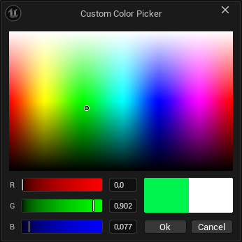
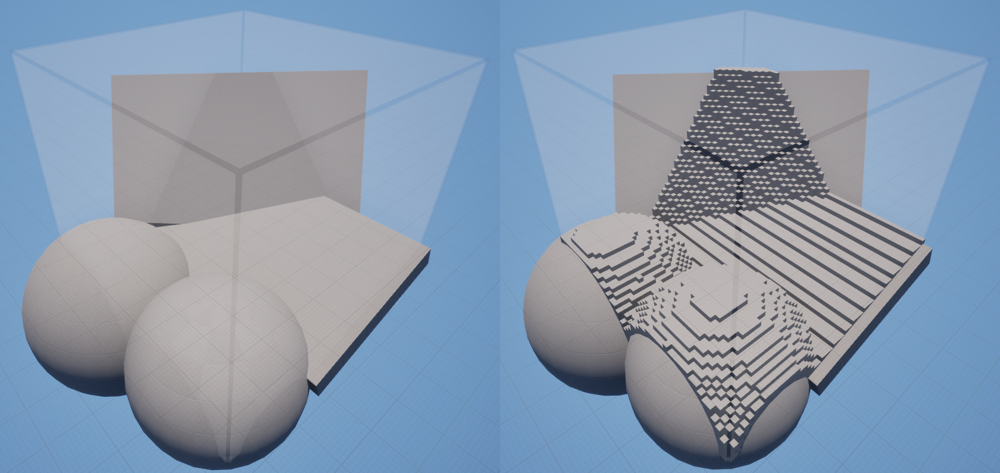

# Boids Simulation in Unreal Engine

This project is my deep dive into the classic Boids flocking algorithm, which I've been fascinated by a couple of years and now is the time to finally explore them. In doing so, I will learn programming concepts like spatial partitioning and GPU-based compute shaders while simultaneously improving my skills in the Unreal Engine.

My goal isn't just to get something that looks cool but also to develop an efficient system that can be adjusted and expanded upon.

---

### Table of Contents

1. [So, What are Boids? 🤔](#so-what-are-boids-)
   - [Early Development & Boundary Handling](#early-development--boundary-handling)
2. [Project Architecture and Class Structure](#project-architecture-and-class-structure)
   - [Core Simulation Layer](#core-simulation-layer)
   - [Visual Layer](#visual-layer)
   - [Data Structures](#data-structures)
   - [Data, Tooling & Slate](#data-tooling--slate)
3. [Spatial Partitioning: Voxel Grid vs. Octree](#spatial-partitioning-voxel-grid-vs-octree)
4. [Future Development Roadmap](#future-development-roadmap)

---

## So, What are Boids? 🤔

Boids are basically simulated "bird-like objects." The cool part is that their complex, lifelike flocking behavior comes from just three simple rules that each boid follows on its own:

1. **Separation** – Steer to avoid crowding local flockmates.  

2. **Alignment** – Steer towards the average heading of local flockmates.  

3. **Cohesion** – Steer to move toward the average position of local flockmates.  

When you combine these rules, the pattern emerges which can be seen in real flocks of birds or schools of fish!

### Early Development & Boundary Handling

In the initial stages of development, the simulation had no collision boundaries. To keep the boids contained, I implemented a "wrapping" behavior where a boid exiting one side of the bounds would instantly teleport to the opposite side.

Here's a look at boids with wrapping mechanic:

This was later replaced by a "soft wall" collision system, which uses pre-computed force vectors to steer boids away from the boundaries, resulting in a more natural look.

And here's with boundry collisions:

---

## Project Architecture and Class Structure

The simulation works on **2 different layers** that separates the main logic from its visual representation. For now there is no data loading, just hardcoded values. Editor tool is creating necessary data, if that data doesn't exist - still no loading yet.

### Core Simulation Layer 

C++ classes and structs that manage data without relying on Unreal's Actor framework.  
* `FBoid`: Simple data struct representing one boid with `Position`, `Velocity` and `Acceleration`. It has no logic besides a basic `Update` to adjust its position.
* `UBoidManagerSubsystem`: Core of the simulation. This `UTickableWorldSubsystem` owns and updates all boids each frame. Its responsibilities include:  
    * Calculating all boid forces (separation, alignment, cohesion, collision).  
    * Broadcasting delegates when simulation data changes.  
* `BoundsMathLibrary`: Helper math library handling all bounds-related calculations.

### Visual Layer 

Couple of `AActor` classes that represent the simulation within the game world. They mostly listen and respond to the `UBoidManagerSubsystem` and `UBoidDataEditorSubsystem`.  
* `AVisualBoid`: Visual representation of a single boid, containing only a mesh. Its position and rotation updates are handled by the `AVisualBoidManager`.  
* `AVisualBoidManager`: Actor that listens to the `BoidManagerSubsystem`. It manages a pool of `AVisualBoid` actors, updating their position and rotation to align with their simulation's counterparts.  
* `UVisualSimulationBoundsData`: Successor of the previous `AVisualWorldBounds` class. This actor visualizes the simulation boundaries and allows to see the precomputed collision and wall data.

### Data Structures

I am currently transitioning from a specific grid implementation to a **generic voxel grid** to handle spatial partitioning and collision data.

* `FVoxelGrid<T>`: A template voxel grid class for storing `T` data with basic getters. This acts as a base for my specialized grid classes.
* `FWorldCollisionVoxelGrid`: A specialized child of `FVoxelGrid`. Each cell stores two `FVectors`: an environment collision vector and a bounds collision vector. This serves as a fast lookup table for collision forces during runtime. Currently work in progress.
* `FBoidCollisionVoxelGrid`: A specialized child of `FVoxelGrid` that stores the IDs of Boids present in that cell. This is updated every frame to optimize the neighbor search algorithm from `O(N²)` to `O(N * K)`. Currently work in progress.

### Data, Tooling & Slate

This section covers the tools enabling in-editor tweaking of the simulation's parameters.

**Data Assets & Managers**
* `UBoidsData` & `UBoundsData`: `UDataAsset`-based classes containing all relevant configuration data (force multipliers, speed, perception radius, grid resolution).
* `UBoidDataEditorSubsystem`: An `UEditorSubsystem` responsible for creating, saving, and generating the simulation data, as well as broadcasting events for any bounds changes in the editor.
* `FEditorBoidDataManager`: Creates necessary `UBoidsData` & `UBoundsData` during editor time for the runtime simulation.
* `FCollisionDataGenerator`: Generates necessary collision data, which includes voxelized environment wall data and collision forces in the simulation bounds. It creates the "soft-wall" around the environment so Boids will steer away naturally.
* `DebugMacros`: Header with a couple of template macros for easier debugging and development.

**Evolution of the Editor Tool**

The primary goal of this tool has always been the **real-time manipulation of Boid parameters** (cohesion, alignment, separation, speed) to allow for instant feedback during the simulation.
*Note: Bounds and collision data are not manipulated in real-time as they require a pre-generation step.*

In the early development stage I initially planned to make checkboxes, float and vector fields **transactable**. In the end I ultimately had to drop that feature due to time constraints in order to prioritize the custom color picker made in Slate and its integration. Below is an early design of how I envisioned the tool in the beginning (*don't take the color scheme seriously, it's was a prototype*).

**The Slate Journey**

As I continued developing the tool, I realized I would need to create a color picker so that the user could pick desired color. This requirement pushed me to explore **Unreal Engine's Slate API** for the first time, which was a really nice challenge. It allowed me to take a deep dive into Slate and develop my own widgets based on Unreal's original implementations.

* `UBoidEditorUtilityWidget`: Base class for the Boids' tool. Broadcasts event on begin and PIE end. Still work in progress.
* `UColorButtonEditorUtilityWidget`: Widget spawning `SCustomColorPicker`. It serves as the bridge between the Slate widget and Blueprint implementation.
* `SCustomColorSlider`: Custom-made color slider with a background gradient of the managed color.
* `SCustomColorPicker`: Custom-made color picker with a color spectrum and RGB channel sliders. It handles events like `OnColorChanged`, `OnColorCancelled`, and `OnColorCommitted`.

And here is current, and probably final design of the tool and the color picker:

---

## Spatial Partitioning: Voxel Grid vs. Octree

To improve the neighbor search from a brute force `O(N²)` check, I looked into both Octrees and Voxel Grids (Uniform Grids). While Octrees perform well in sparse environments, I ultimately chose a **Voxel Grid**, despite my initial study of QuadTrees, which really pushed me into making this project. Here's my thought process and reasoning as to why I picked the second one:

* **Distribution:** The boids should be spread fairly uniformly spread throughout the simulation area. Voxel Grids are excellent in dense or uniform scenarios.  
* **Lookup Speed:** Voxel Grids provide a constant-time `O(1)` lookup for knowing which cell contains a boid. An Octree's lookup is `O(log n)`, which is relatively quick, but is ultimately the slower choice of the two.
* **Dynamic Objects:** Since boids move every frame, an Octree would need to be partially or fully rebuilt frequently, which was the main disadvantage for me. A Voxel Grid is significantly easier to update with the boids' new positions each frame, due to being a simple array.

I still do believe OctTrees are definitely a better alternative for very large and sparse areas, such as an open worlds.

Here is first voxelized representation of the very basic terrain (Bounds Extent: 1000 per axis, Grid Resolution: 50 per axis):

---

## Future Development Roadmap

Since it is my main project, I structured it with clear roadmap goals to make it easier for me to track the progress:

1. **Implement Tool UI:** Create the visual interface for the Editor Utility Widget.
2. **Template Voxel Grid:** Develop a generic, reusable Voxel Grid class to optimize boid-to-boid collision and neighbor finding. I will also use this class in a future project on 3D pathfinding. Test performance between brute force solution - `O(N²)` and newly created VoxelGrid - `O(N * K)`.
3. **Environment Collision Grid:** Set up the voxelized collision system for static geometry using the generic class.  
4. **Data Integration:** Connect the Editor Tool and `UBoidManagerSubsystem` to save/load `UBoidsData` & `UBoundsData` assets.
5. **Template Object Pool:** Create a generic object pool for managing `FBoid`, `AVisualBoid` actors, and Threads.  
6. **Compute Shader (Boid Logic):** Major optimization target and personal minimal goal, shift the main boid update loop to a compute shader in order to take full advantage of extremely powerful GPUs. 
7. **Compute Shader (Voxel Grid):** If time permits, move the Voxel Grid neighbor search to a compute shader as well for even further performance increases.
8. **Compute Shader (Collision Generation):** As a final goal, transfer the pre-computation of the environment collision data into it as well.

If you've made it this far, thank you for taking the time to read through all of this. I have enjoyed this journey so far and look forward to pushing it to new heights.